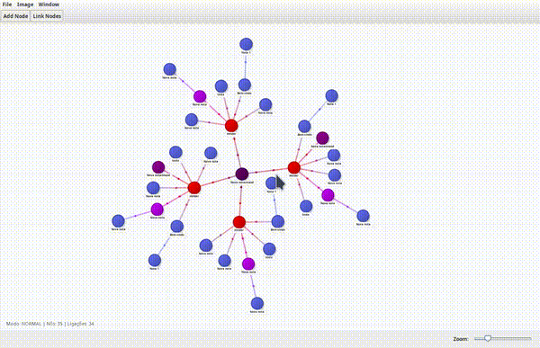

---


<h1 align="center">
  <br>
  Graph Notes
</h1>

<p align="center">
  Editor visual de grafos com notas ricas em HTML, animações modernas e interface profissional em Java Swing.
</p>

<p align="center">
  
  
  
  
  
</p>

---

# 🎥 Demonstração (Mockup)

> **GIF demonstrativo** (podes substituir depois pelo real)

<p align="center">
  
</p>

---

# 🧩 Funcionalidades

### 🟣 Manipulação de Nós
- Criar, remover, editar
- Editor avançado em HTML (negrito, itálico, imagens, listas…)
- Mudança de cor com *color picker*
- Criação automática de nó ligado

### 🟢 Ligações (Edges)
- Criação intuitiva: selecionar nó A → nó B
- Animações com partículas
- Gradiente dinâmico baseado nas cores dos nós

### ⚙️ Interação
| Função | Método |
|--------|--------|
| Zoom | Roda do rato |
| Pan | Botão do meio ou Shift + Esquerdo |
| Editar nó | Duplo clique |
| Menu contextual | Botão direito |
| Undo/Redo | Ctrl+Z / Ctrl+Y |
| Novo nó | Ctrl+N |

### 🌗 Tema Claro & Escuro
- Alternância instantânea
- Suporte total na área de desenho

### 🖼 Exportação
- PNG com fundo configurável
- JPG
- Exporta zoom/pan aplicado
- Guarda cores dos nós

### 📁 Ficheiros
- Salvar `.gn` (JSON via Gson)
- Abrir
- Merge entre grafos
- Reset de zoom e pan

---

# 📂 Estrutura do Projeto

```

.  
├── src  
│ ├── model  
│ │ ├── Node.java  
│ │ ├── Edge.java  
│ │ └── GraphData.java  
│ └── ui  
│ ├── GraphNotesApp.java  
│ ├── GraphPanel.java  
│ └── NoteDialog.java  
├── lib  
│ └── gson-2.10.1.jar  
├── Exemplos  
│ ├── teste.gn  
│ └── demo.png  
└── docs  
├── logo.svg  
└── demo.gif

```

---

# 🛠 Instalação & Execução

## Linux / MacOS

```bash
javac -cp lib/gson-2.10.1.jar -d bin src/model/*.java src/ui/*.java
java -cp bin:lib/gson-2.10.1.jar ui.GraphNotesApp
````

## Windows

```powershell
javac -cp lib\gson-2.10.1.jar -d bin src\model\*.java src\ui\*.java
java -cp bin;lib\gson-2.10.1.jar ui.GraphNotesApp
```

---

# 🔧 Arquitetura Interna

### **GraphPanel.java**

- Motor principal da aplicação
    
- Renderização via Java2D
    
- Layout de força física (force-directed)
    
- Pan, zoom, hover, drag
    
- Undo/Redo com stack de snapshots
    
- Exportação de imagem
    
- Sistema de eventos moderno
    

### **NoteDialog.java**

- Editor HTML com:
    
    - UndoManager
        
    - Inserção de imagem
        
    - Seleção de cor
        
    - Tamanhos de fonte
        
    - Formatação básica
        
- Integração direta com o nó selecionado
    

### **GraphData.java**

- DTO persistível contendo:
    
    - Lista de nós
        
    - Lista de arestas
        

### **Node.java / Edge.java**

- Representação serializável do grafo em disco
    

---

# 📦 Formato `.gn`

```json
{
  "nodes": [
    {
      "x": 300,
      "y": 180,
      "label": "Bem-vindo",
      "note": "<p>Olá mundo</p>",
      "colorHex": "#636EFA"
    }
  ],
  "edges": [
    { "a": 0, "b": 1 }
  ]
}
```

---

# 📌 Roadmap

| Estado | Tarefa                 |
| ------ | ---------------------- |
| ✅      | Zoom e Pan modernos    |
| ✅      | Guardar cor do nó      |
| ✅      | Editor de notas HTML   |
| ⬜      | Sistema de plugins     |
| ⬜      | Modo apresentação      |
| ⬜      | Exportação para PDF    |
| ⬜      | Autolayout inteligente |
| ⬜      | Minimap                |

---

# 📝 Changelog

## **v1.2 – 13 Nov 2025**

- Adicionado slider de zoom
    
- Guardada cor dos nós
    
- Animações suavizadas nas arestas
    
- Painel de notas completamente redesenhado
    
- Aperfeiçoamentos de interface
    

## **v1.1**

- Undo/Redo completo
    
- Tema escuro
    
- Merge de grafos
    

## **v1.0**

- Primeira versão estável
    

---

# 🙋 FAQ

### ❓ Como faço zoom?

Roda do rato ou slider no rodapé.

### ❓ Como movo o grafo?

Botão do meio OU Shift + botão esquerdo.

### ❓ Como edito um nó?

Duplo clique em cima.

### ❓ Posso inserir imagens na nota?

Sim! O editor suporta PNG/JPG inseridos direto no texto.

### ❓ Os grafos guardam cores e HTML?

Sim, tudo é persistido no `.gn`.

---

# 🤝 Como Contribuir

1. Fazer fork do repositório
    
2. Criar branch de funcionalidade:
    

```bash
git checkout -b feature/minha-funcionalidade
```

3. Confirmar que compila:
    

```bash
javac -cp lib/gson-2.10.1.jar -d bin src/**/*.java
```

4. Criar _pull request_
    

---

# 📜 Licença — MIT

Este projeto é distribuído sob a licença MIT.  
Podes usar comercialmente, modificar, redistribuir e integrar noutras apps.

---

# 👨‍💻 Autor

**Vritik Valabdás**  
🇲🇿 Moçambique  
Apaixonado por Java, Swing.
