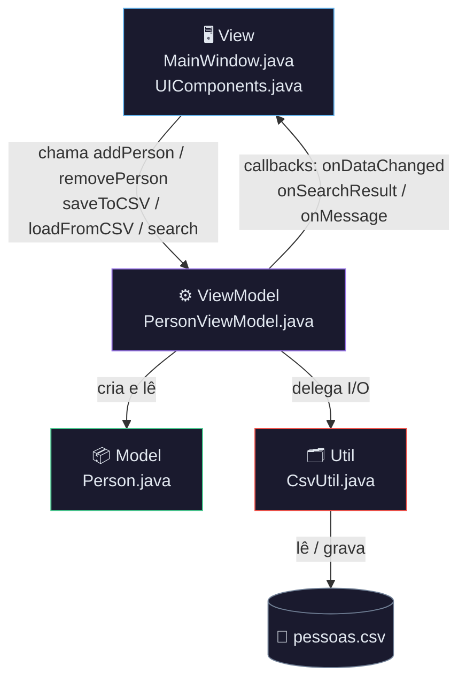
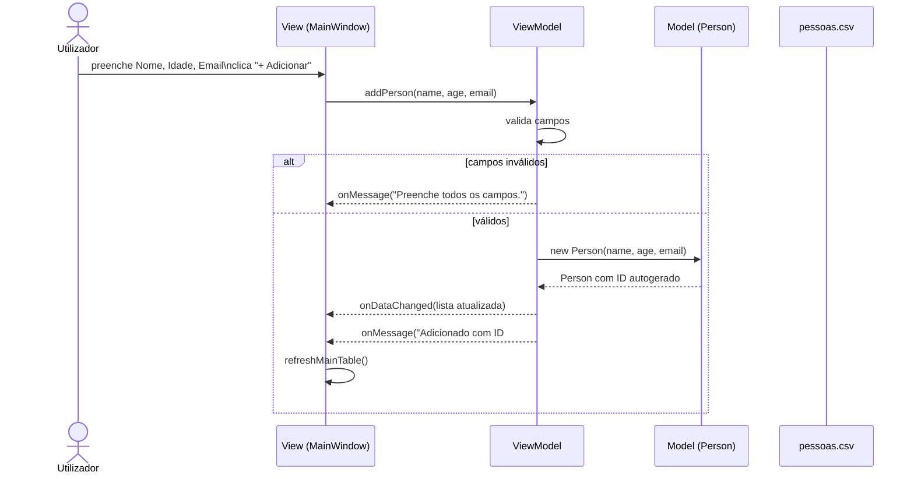
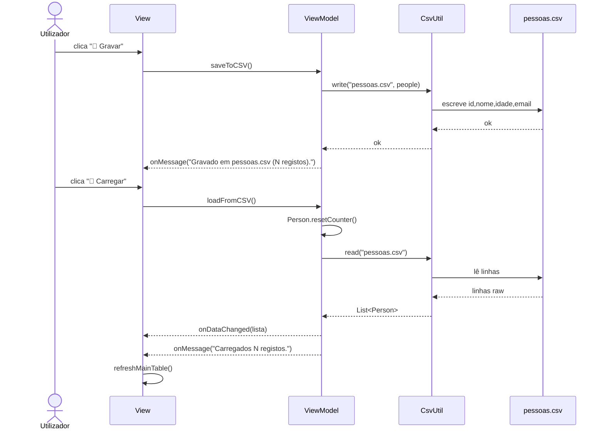
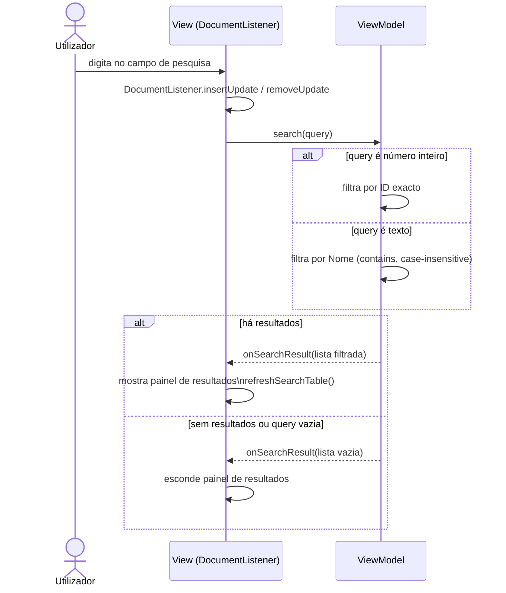

# MVVM CSV Manager — Swing + AWT + Graphics2D

## Estrutura do projeto

```
src/
└── com/mvvmcsv/
    ├── Main.java                        ← ponto de entrada
    ├── model/
    │   └── Person.java                  ← MODEL: dados puros
    ├── viewmodel/
    │   └── PersonViewModel.java         ← VIEWMODEL: lógica + estado
    ├── view/
    │   ├── MainWindow.java              ← VIEW: UI Swing
    │   └── UIComponents.java            ← componentes G2D customizados
    └── util/
        └── CsvUtil.java                 ← leitura/gravação CSV
```

---

## Arquitetura MVVM



**Regras rígidas:**
- A View **nunca** acede ao Model diretamente
- O ViewModel **nunca** importa `javax.swing` ou `java.awt`
- O CsvUtil não conhece nem a View nem o ViewModel

---

## Fluxo — Adicionar pessoa



---

## Fluxo — Gravar e Carregar CSV



---

## Fluxo — Pesquisa em tempo real



---

## Padrão MVVM aplicado

| Camada        | Classe                | Responsabilidade                              |
|---------------|-----------------------|-----------------------------------------------|
| **Model**     | `Person`              | Dados puros — ID, nome, idade, email          |
| **ViewModel** | `PersonViewModel`     | Lógica + estado + callbacks → nunca toca em Swing |
| **View**      | `MainWindow`          | UI pura — chama ViewModel, recebe callbacks   |
| **View**      | `UIComponents`        | Componentes G2D customizados (botões, campos) |
| **Util**      | `CsvUtil`             | I/O de ficheiro CSV — sem conhecimento de UI  |

---

## Como compilar e correr

### Terminal (sem IDE)

```bash
# 1. Entrar na pasta src
cd src

# 2. Compilar todos os ficheiros
javac -d ../out $(find . -name "*.java")

# 3. Correr
cd ../out
java com.mvvmcsv.Main
```

### Eclipse
1. `File → New → Java Project`
2. Copia os ficheiros para `src/`
3. Cria os packages: `com.mvvmcsv`, `com.mvvmcsv.model`, `com.mvvmcsv.viewmodel`, `com.mvvmcsv.view`, `com.mvvmcsv.util`
4. `Run As → Java Application → Main`

### IntelliJ IDEA
1. `File → Open` → seleciona a pasta `mvvm-csv`
2. Marca `src` como *Sources Root*
3. `Run → Edit Configurations → Main class: com.mvvmcsv.Main`

---

## Formato do CSV

```
id,nome,idade,email
1,Susana Jesus,19,susana.jesus95@sapo.pt
2,Nuno Alves,26,nuno.alves95@gmail.com
```

> O ficheiro `pessoas.csv` é criado/lido na **raiz do projeto** (pasta onde corres o programa).